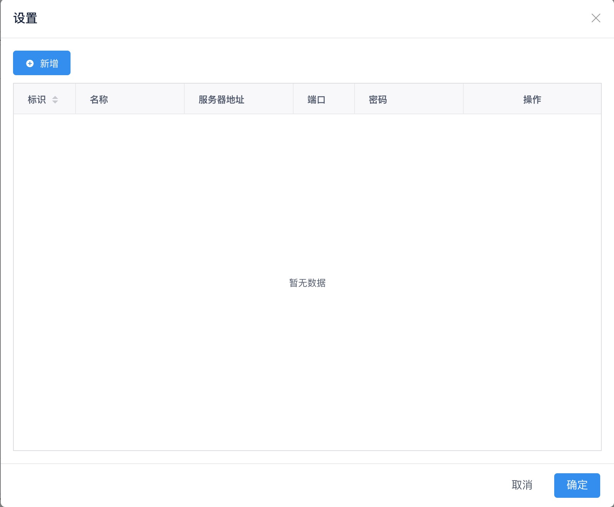
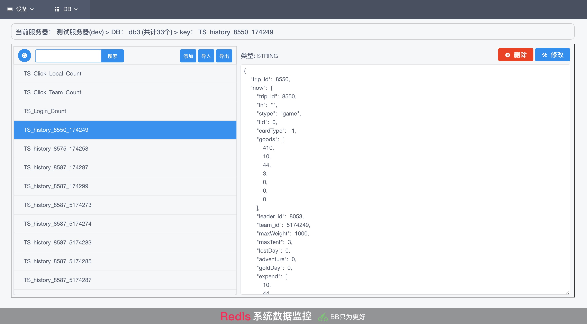
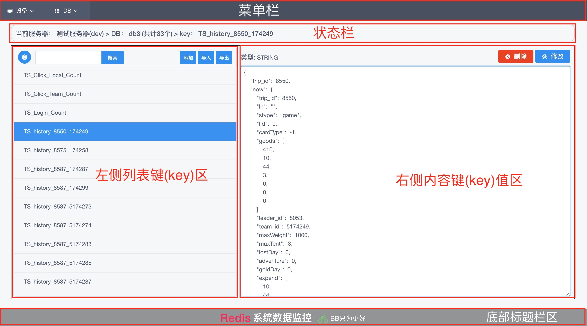
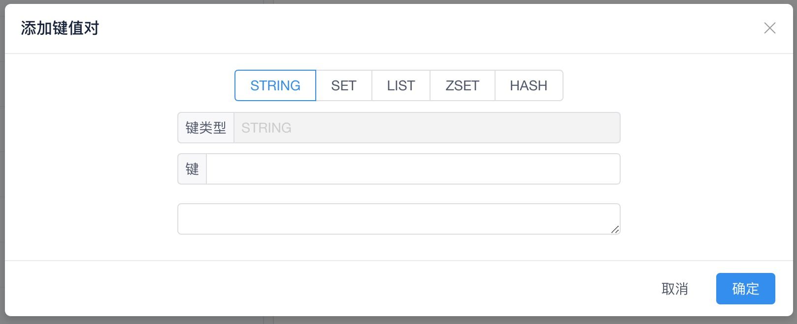
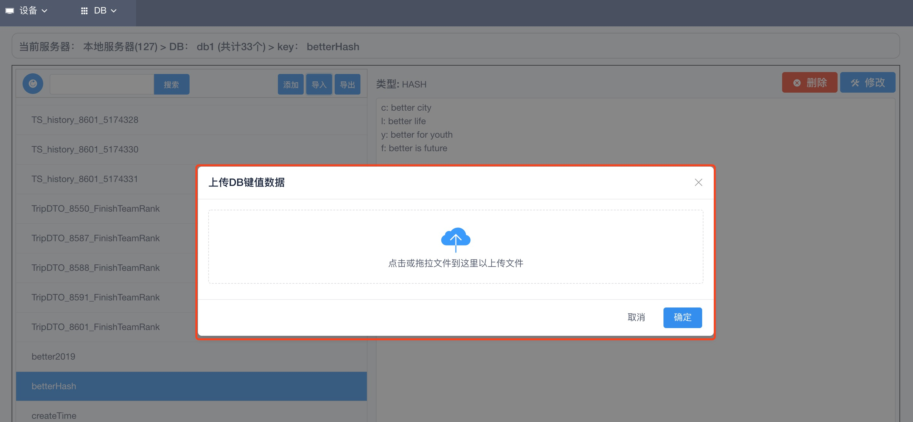

# Online Redis Manager

## 概述

本工具采用betterlife框架经精简开发而成，方便用于Redis的管理、快速开发；可实现Redis多服务器多DB的键值的增删改查、导入导出。是世界领先的Redis IDE在线管理工具。

## 使用说明

  - 起步: Redis服务器配置
  - 选择设备[服务器] -> 选择DB -> 列表键(key) -> 筛选键(key)
  - 选择查看键(key)值 -> 修改键(key)的值 ->  删除键(key)
  - 新增DB ｜ 删除DB 
  - 重置初始化列表键(key) ｜ 新增键(key) ｜ 
  - 导入所有键(key) ｜ 导出经筛选的所有键(key) ｜ 导出所有键(key)
  
## 界面UI分解

  - 主要界面分4个
    - 设置界面
    - 主界面
    - 新增键(key)界面
    - 导入上传界面
  

  - 界面UI如下

    - 设置界面

      

    - 主界面
    
      

    - 主界面

      

    - 新增键(key)界面

      

    - 导入上传界面

      

## 功能详解

  方便用于Redis的管理、快速开发；可实现Redis多服务器多DB的键值的增删改查、导入导出。

  第一次打开页面的时候，会自动弹出设置设备(服务器)页面，当设置好服务器配置参数后，即可正常使用Redis管理器的强大功能了。

  - 设置设备(服务器)
    - 第一次打开页面的时候，会自动弹出设置设备(服务器)页面
    - 点击左上角的新增按钮，弹出新增设备配置界面，会有以下五项填入项，标识、名称、服务器为必填项，端口如果，如无密码则不需要填写密码。
      - 标识: 必填项，自定义，是设备服务器唯一标识,一般为英文、数字如: prod,dev,local,127。
      - 名称: 必填项，自定义，是设备服务器的易记住的名称，一般为中文等如: 生产服务器、测试服务器、本地服务器等。
      - 服务器: 必填项，Redis服务器IP地址或者域名
      - 端口: 非必填项，Redis服务器服务端口，不填写则为Redis默认端口:6379。
      - 密码: 非必填项，如无密码则不需要填写密码。
    - 添加完成配置后
    - 编辑已添加过的配置
    - 删除无效或不再使用的配置
    - 完成配置设置后关闭设置窗口后
  
  - 选择设备(服务器)
    - 选择指定的设备(服务器)
    - 选择设备(服务器)后
  - 选择DB
    - 选择DB
    - 选择DB后显示
    - 选择DB后主界面左侧列表键(key)显示
  - 筛选键(key)
    - 输入需寻找键(key)的关键字
    - 点选右侧的搜索按钮后
  - 新增键(key)值
    - Redis的键(key)的类型分为8种: STRING, SET, LIST, Sorted sets, Hashes, HyperLogLogs, Geocoding, Streams。
    - 本管理器支持的键(key)的类型有5种: STRING, SET, LIST, Sorted sets, Hashes; 其它3种: HyperLogLogs, Geocoding, Streams; 暂时没有使用场景，没有相应的功能，以后视实际情况再添加。
    - Java的对象序列化数据无法解析为可读的数据，暂不支持。
    - 点选左侧列表键(key)区域上方按钮区右侧新增按钮
      - 新增String类型键(key)
      - 新增Set类型键(key)
      - 新增LIST类型键(key)
      - 新增Sorted sets类型键(key)
      - 新增Hashes类型键(key)

  - 修改键(key)值
  - 删除键(key)值
  - 批量导入所有键(key)
  - 导出经筛选的所有键(key) 
  - 导出所有键(key)
  - 新增DB
  - 删除DB