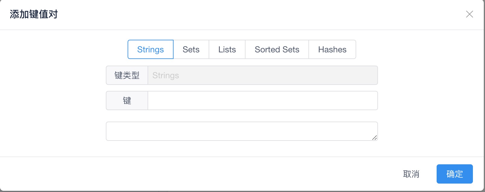
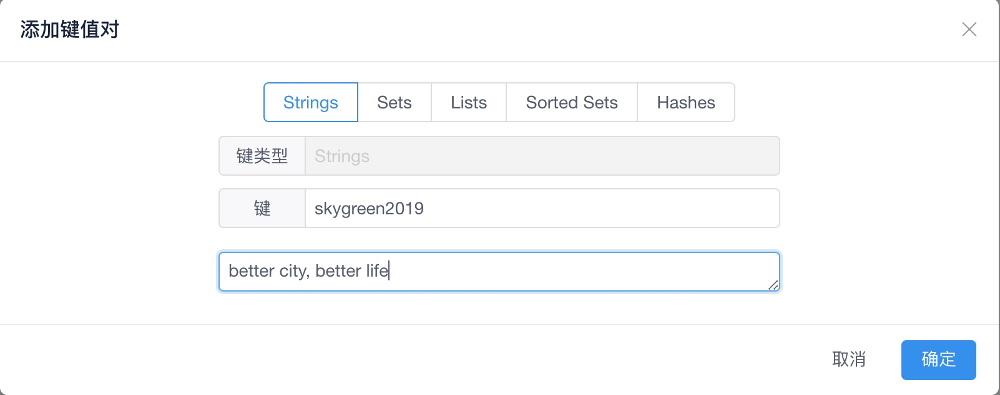
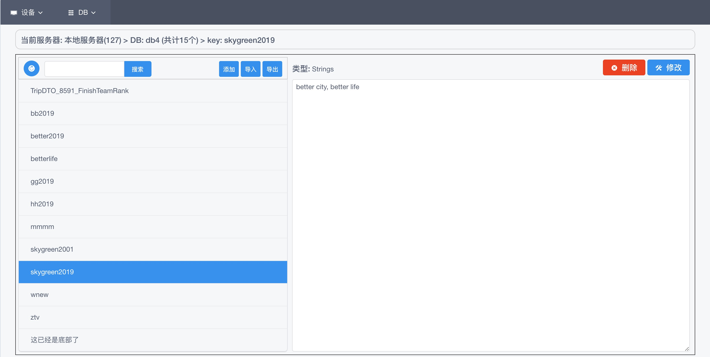
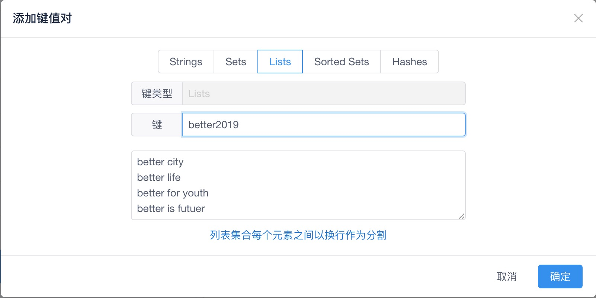
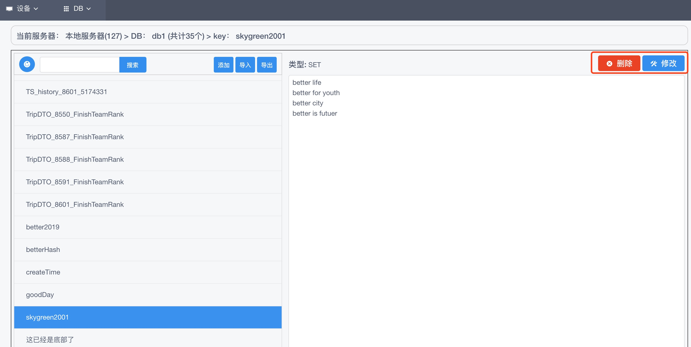
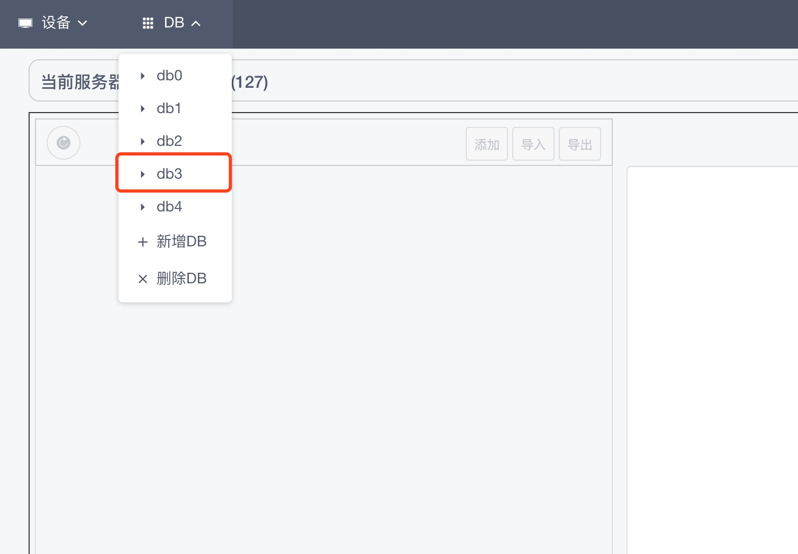

# Online Redis Manager

## 概述

本工具采用betterlife框架经精简开发而成，方便用于Redis的管理、快速开发；可实现Redis多服务器多DB的键值的增删改查、导入导出。是世界领先的Redis IDE在线管理工具。

## 使用说明

  - 起步: Redis服务器配置
  - 选择设备[服务器] -> 选择DB -> 列表键(key) -> 筛选键(key)
  - 选择查看键(key)值 -> 修改键(key)的值 ->  删除键(key)
  - 新增DB ｜ 删除DB 
  - 重置初始化列表键(key) ｜ 新增键(key) ｜ 
  - 导入所有键(key) ｜ 导出经筛选的所有键(key) ｜ 导出所有键(key)
  
## 界面UI分解

  - 主要界面分5个
    - 设置界面
    - 主界面
    - 新增键(key)界面
    - 导入上传界面
    - 删除DB界面
  
  - 界面UI如下

    - 设置界面

      

    - 主界面
    
      

    - 主界面 
      - 顶部: 菜单栏。功能选择区，包括选择服务器、DB等。
      - 上方: 标题栏。显示在内容区上方，提醒用户之前的历史操作，如选择了本地服务器(127),选择了db3等
      - 左侧: 列表键(key)区。显示在内容区左侧，显示所选db下所有的键(key)列表
      - 右侧: 内容键(key)值区。显示在内容区右侧，显示所选键(key)的值
      - 底部: 标题栏区。显示Redis系统数据监控，及logan

      

    - 新增键(key)界面

      

    - 导入上传界面

      

    - 删除DB界面

      

## 功能详解

  方便用于Redis的管理、快速开发；可实现Redis多服务器多DB的键值的增删改查、导入导出。

  第一次打开页面的时候，会自动弹出设置设备(服务器)页面，当设置好服务器配置参数后，即可正常使用Redis管理器的强大功能了。

  - 设置设备(服务器)
    - 第一次打开页面的时候，会自动弹出设置设备(服务器)页面

      

    - 点击左上角的新增按钮，弹出新增设备配置界面，会有以下五项填入项，标识、名称、服务器为必填项，端口如果，如无密码则不需要填写密码。
      - 标识: 必填项，自定义，是设备服务器唯一标识,一般为英文、数字如: prod,dev,local,127。
      - 名称: 必填项，自定义，是设备服务器的易记住的名称，一般为中文等如: 生产服务器、测试服务器、本地服务器等。
      - 服务器: 必填项，Redis服务器IP地址或者域名
      - 端口: 非必填项，Redis服务器服务端口，不填写则为Redis默认端口:6379。
      - 密码: 非必填项，如无密码则不需要填写密码。

      

    - 添加完成配置后

      

    - 点击已添加设备(服务器)设置右侧的编辑按钮

      

    - 编辑已添加过的配置

      

    - 点击已添加设备(服务器)设置右侧的删除按钮

      

    - 删除无效或不再使用的配置

      

    - 完成配置关闭设置窗口后

      - 顶部菜单栏只有菜单: 设备

      

  - 选择设备(服务器)

    - 选择指定的设备(服务器)
      - 菜单设备的命名规则: 名称(标识)
      - 选择设备: 本地服务器(127)

      

    - 选择设备(服务器)后，获取该服务器下所有DB
      - 顶部菜单栏新增一个菜单: DB
      - 上方状态栏显示: 当前服务器: 本地服务器(127)
      - 点选菜单: DB后会显示该服务器下所有DB的列表

      

  - 选择DB

    - 选择DB: db3

      

    - 选择DB后显示
      
      

    - 选择DB后主界面左侧列表键(key)显示
      - 上方状态栏会显示选择DB下共计多少个键(计数)
      - 上方状态栏显示: 当前服务器: 本地服务器(127) > DB: db3 (共计40个)

      

  - 查看键(key)值
  
    - 点选想要查看或者编辑的键(key): TS_history_8587_174267
      - 点选前，右侧内容键(key)值区删除按钮为灰色，不可操作
      - 点选前，右侧内容键(key)值区修改按钮为灰色，不可操作
    
      

    - 显示键(key)值:TS_history_8587_174267
      - 点选后，右侧内容键(key)值区显示键(key)类型: Strings
      - 点选后，右侧内容键(key)值区删除按钮为蓝色，可操作
      - 点选后，右侧内容键(key)值区修改按钮为蓝色，可操作
    
      

  - 筛选键(key)

    - 输入需寻找键(key)的关键字: 8587

      

    - 点选右侧的搜索按钮后
      - 所有带有8587关键字名称的键(key)都被筛选显示出来

      

  - 新增键(key)值

    - Redis的键(key)的类型分为8种: Strings, Sets, Lists, Sorted sets, Hashes, HyperLogLogs, Geocoding, Streams。

    - 本管理器支持的键(key)的类型有5种: Strings, Sets, Lists, Sorted sets, Hashes; 其它3种: HyperLogLogs, Geocoding, Streams; 暂时没有使用场景，没有相应的功能，以后视实际情况再添加。

    - Java的对象序列化数据无法解析为可读的数据，暂不支持。

    - 点选左侧列表键(key)区域上方按钮区右侧新增按钮

      

      - 新增Strings类型键(key): skygreen2019

        

      - 输入Strings类型键(key)值: better city, better life

        

      - 提示新增完成: 新增[skygreen2019]的值成功！

        

      - 新增Strings类型键(key)完成

        

      - 新增Sets类型键(key): skygreen2001

        - 列表集合每个元素之间以换行作为分割
      
        

      - 新增Sets类型键(key)完成
      
        

      - 通过命令行查看Sets类型键(key)完成后情况
      
        

      - 新增Lists类型键(key): better2019

        - 列表集合每个元素之间以换行作为分割
      
        

      - 新增Lists类型键(key)完成

        

      - 新增Sorted sets类型键(key): goodDay
        
        - 列表集合每个元素之间以换行作为分割
      
        

      - 新增Sorted sets类型键(key)完成
      
        
      
      - 新增Hashes类型键(key): betterHash
        
        - HASH的键值格式如下:
          ```
          hashKey: val
          hashKey1: val1
          hashKey2: val2
          ```

        

      - 新增Hashes类型键(key)完成
        
        

      - 通过命令行查看Hashes类型键(key)完成后情况
        
        

  - 修改键(key)值

    - 点选右侧内容键(key)值区域上方按钮区右侧修改按钮
        
        

    - 提示修改键(key)值完成

        

    - 修改键(key)值完成后右侧内容键(key)值区显示

        

  - 删除键(key)值
    - 点选右侧内容键(key)值区域上方按钮区右侧删除按钮
    
        

    - 提示删除键(key)值完成

        

  - 批量导入所有键(key)
  
    - 导入所有键(key)的Excel表格内容
    
        

    - 点击左侧列表键(key)区域上方按钮区右侧导入按钮

        

    - 弹出上传文件窗口
        
        

    - 选择需导入所有键(key)的Excel文件

        

    - 点击确定按钮后，导入所有键(key)
    
        

  - 导出经筛选的所有键(key) 

    - 输入需寻找键(key)的关键字: 8587

      

    - 点选右侧的搜索按钮后
      - 所有带有8587关键字名称的键(key)都被筛选显示出来

      

    - 点击左侧列表键(key)区域上方按钮区右侧导出按钮

        

    - 导出筛选键(key)的Excel表格内容

        

  - 导出所有键(key)

    - 点击左侧列表键(key)区域上方按钮区右侧导出按钮

        

    - 导出所有键(key)的Excel表格内容

        

  - 新增DB

    - 点击顶部: 菜单栏 DB，选择菜单项: 新增DB
      - Redis里db的名称是以索引为后缀的

        

    - 顶部: 菜单栏 DB列表中有了新增的DB
      - 如已有DB: db0, db1, db2, db4, 那么新增db就是db3。
      - 如已有DB: db0, db1, db2, db3, db4, 那么新增db就是db5，以此类推。

        

    - 默认创建了一个键(key): createTime
      - Redis因为至少要有一个键(key), 该db才算存在。
      - 因此新建DB会默认创建一个键(key),值默认是创建DB的时间。
        

  - 删除DB

    - 点击顶部: 菜单栏 DB，选择菜单项: 删除DB

        

    - 在弹窗里选择需要删除的DB: db3

        

    - 弹窗再次确认删除DB: db3

        

    - DB列表中没有了已删除的DB: db3

        


